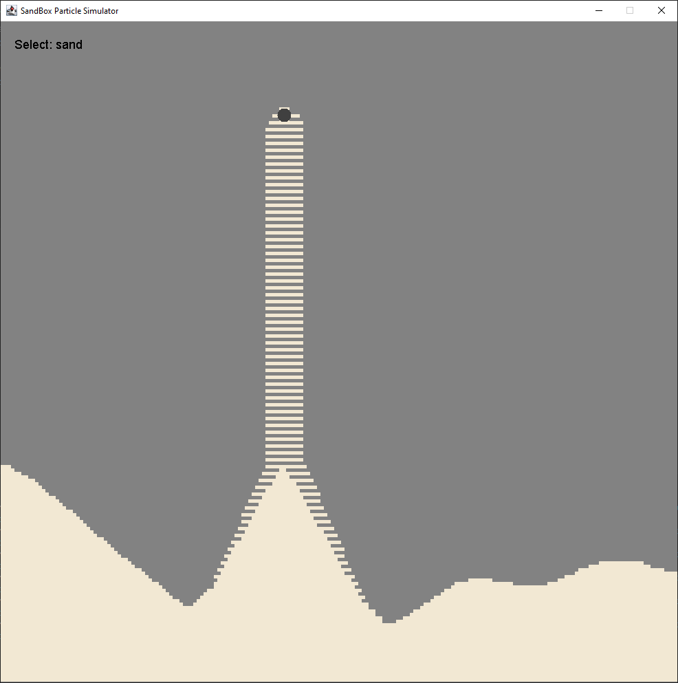
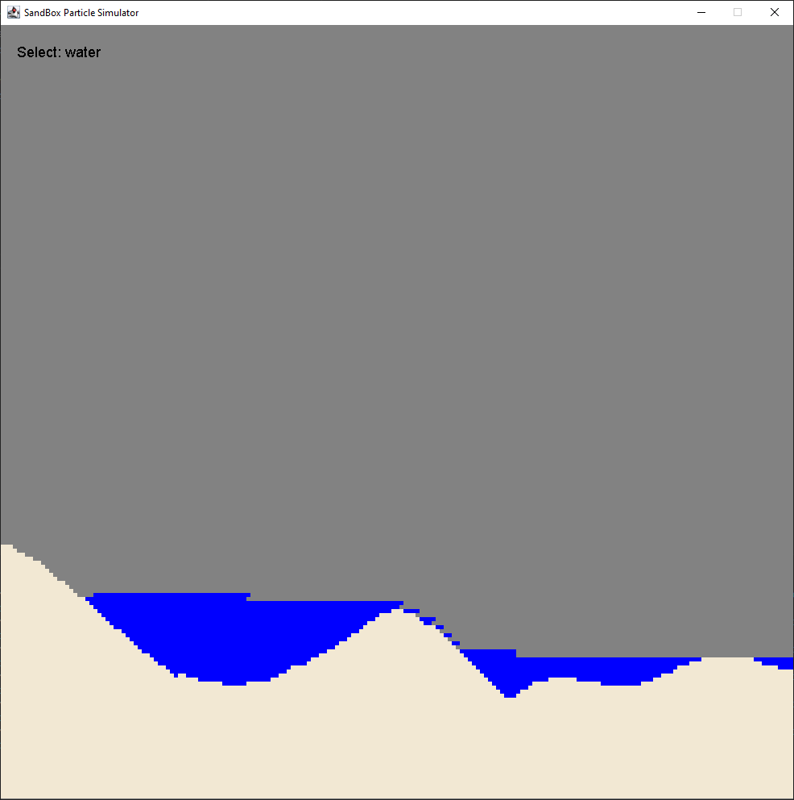
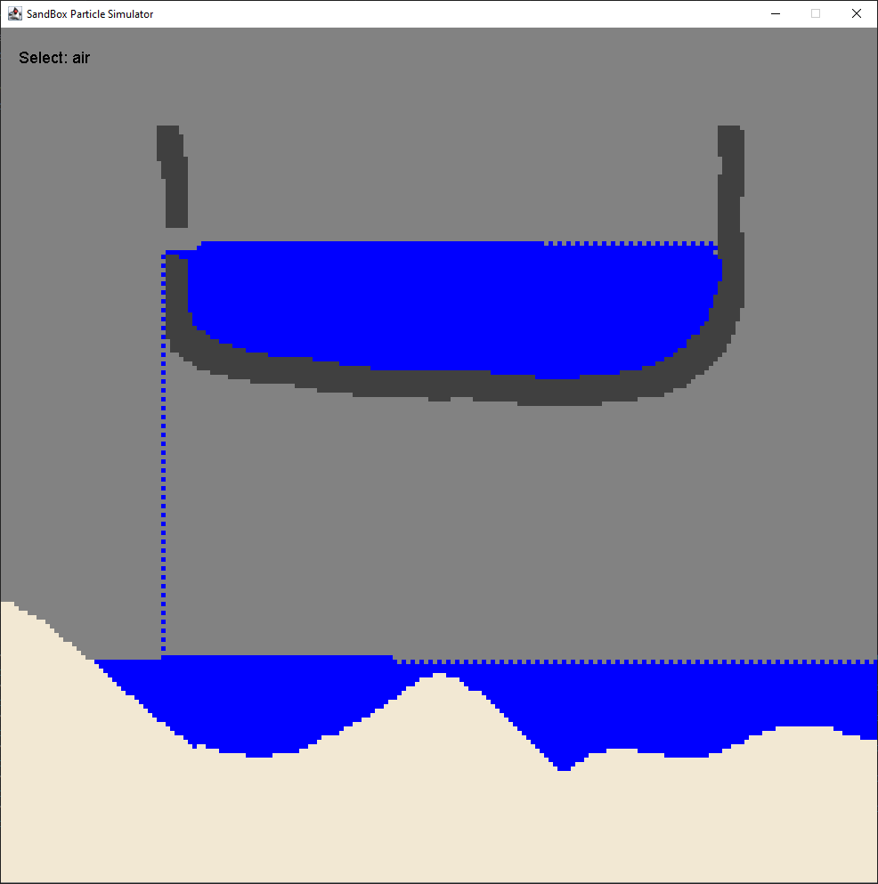
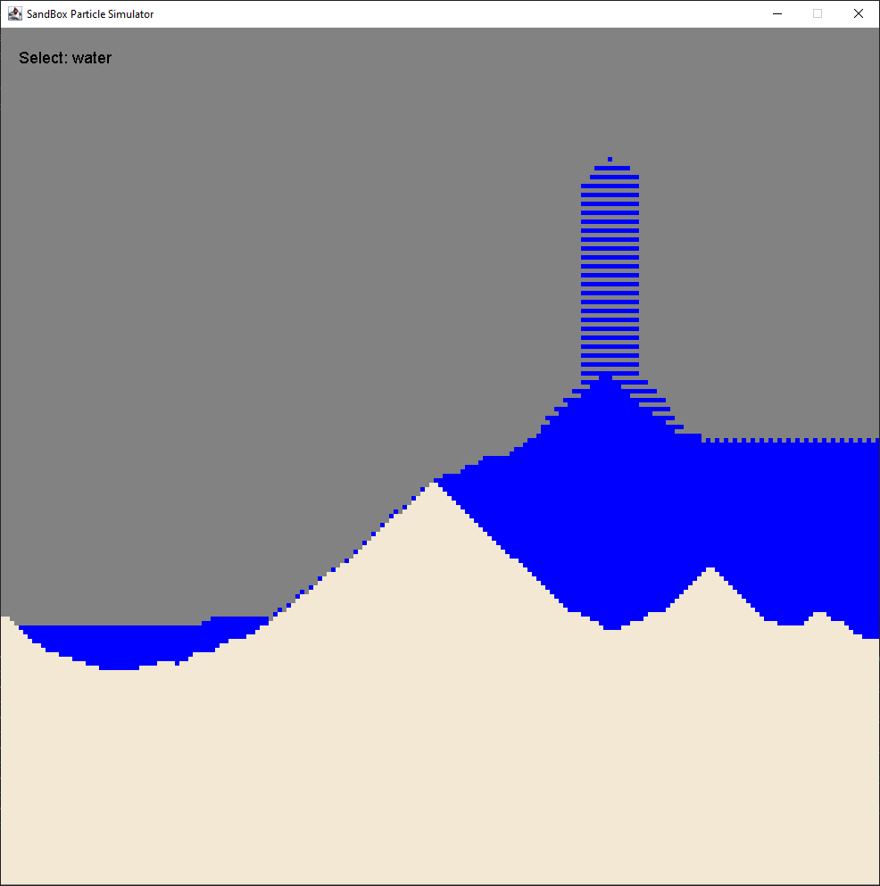
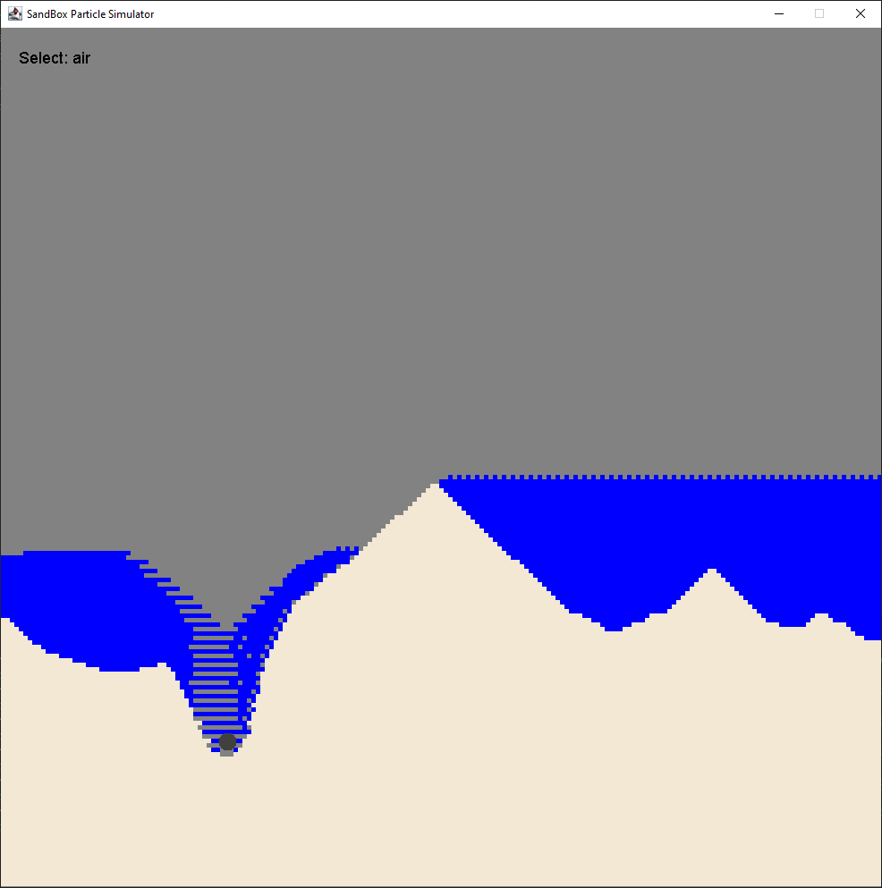
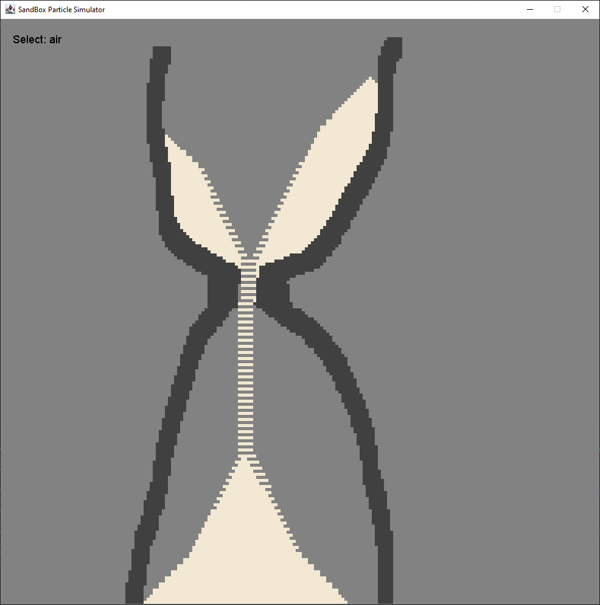

# Grid-Based-Sandbox-Simulator

## Table of Contents

- [Overview](#overview)
- [Requirements](#requirements)
- [Setup](#setup)
- [Overview](#Overview)

## Overview

A Java-based 2D particle sandbox simulation that models gravity, fluid flow, and solid interactions. Users can use the mouse to place and modify particles like sand, water, and solid blocks, creating a dynamic grid-based environment.

## Requirements

Before running this project, ensure that you meet the following requirements:

### Software Dependencies
1. **Java 19.0.0 (or later)**: Be sure to use Java 19 or newer.
2. **Java Swing Libary**: This libary included need features like JFrame, JPanel, and SwingUtilities.

## Setup

### Step 1: Clone the Repository
First, clone or download this repository to your local machine.
```
git clone https://github.com/DaveMorra/Grid-Based-Sandbox-Simulator.git
```
Then, navigate to the source directory:
```
cd Grid-Based-Sandbox-Simulator/src
```
### Step 2: Compile and Run
Quickly build and run the project in any IDE that supports java (e.g., IntelliJ IDEA, Eclipse, or javac).
Alternatively, you can compile and run it directly from the command line on any system with a built-in Java compiler.

Compile the files below:
```
javac Models/Particle.java Models/UserMouseEvent.java JFrameWindow.java ParticleEnv.java
```

Then, Run the main program:
```
java MainSimulator.java
```

## Overview

Sand is being generated and falls downward.



Water flows downhill into a lower water body.



Water is pouring out of a solid bowl


Water is being spawned and flows accordingly


The user drills a hole by replacing ground blocks with air


An hourglass made using sand and solid blocks

